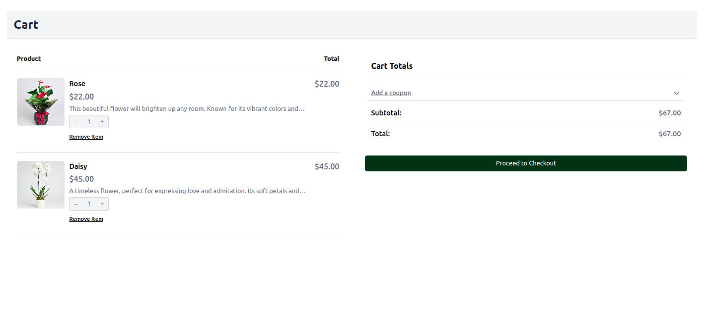
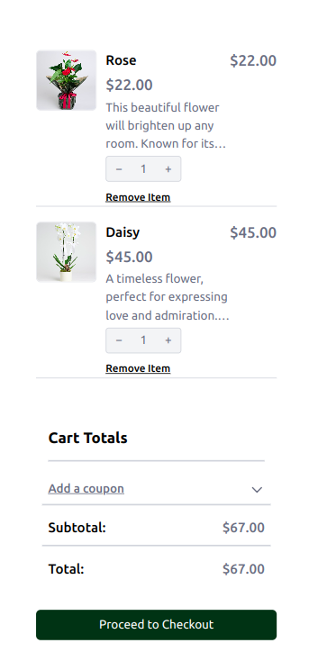

# Order Management System

Bu proje, siparişlerin alındığı, işlendiği ve takip edildiği mikro servis tabanlı bir uygulamadır. RabbitMQ ve SQLite kullanarak servisler arasında iletişim ve veri yönetimi sağlanır.

## Proje Özeti

- **RabbitMQ**: Servisler arası mesajlaşma sağlar.
- **SQLite**: Mikro servisler için veritabanı yönetimi sağlar.
- **Docker**: Tüm servisler Docker konteynerleri içinde çalıştırılır.

## Servisler
Bu projede 4 ana servis bulunmaktadır:

- **Product Service**: Ürünlerle ilgili işlemleri yönetir.

- **Inventory Service**: Envanter yönetimi sağlar.

- **Order Service**: Sipariş işlemleri yönetir.

- **Frontend**: Kullanıcı arayüzü sağlar.

## Kurulum

Bu projeyi yerel olarak çalıştırmak için aşağıdaki adımları takip edebilirsiniz.

### 1. Depoyu Klonlayın

```
git clone https://github.com/kilicsamet/order-managment-system.git
cd order-management-system
```

### 2. Projenin tüm servislerini başlatmak için Docker Compose kullanın

```
docker-compose up --build
```

### 3. Portlar

Uygulama aşağıdaki portlarda çalışacaktır:

- **RabbitMQ Web Management**: http://localhost:15672 (Kullanıcı: guest, Şifre: guest)

- **Product Service**: http://localhost:8080

- **Order Service**: http://localhost:8082

- **Inventory Service**: http://localhost:8081

- **Frontend**: http://localhost:3000
  
## Projenin Görselleri

### 1. Sepet Ekranının Normal Görünümü
Bu görsel, sepet ekranının masaüstü görünümünü göstermektedir.



### 2. Sepet Ekranının Mobil Görünümü
Bu görsel, sepet ekranının mobil görünümünü göstermektedir.




